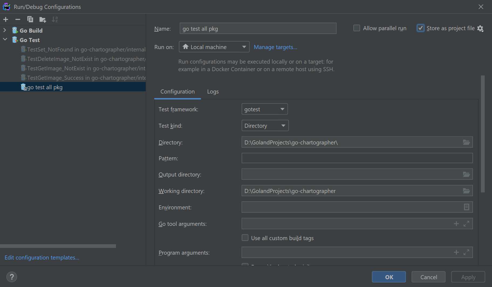
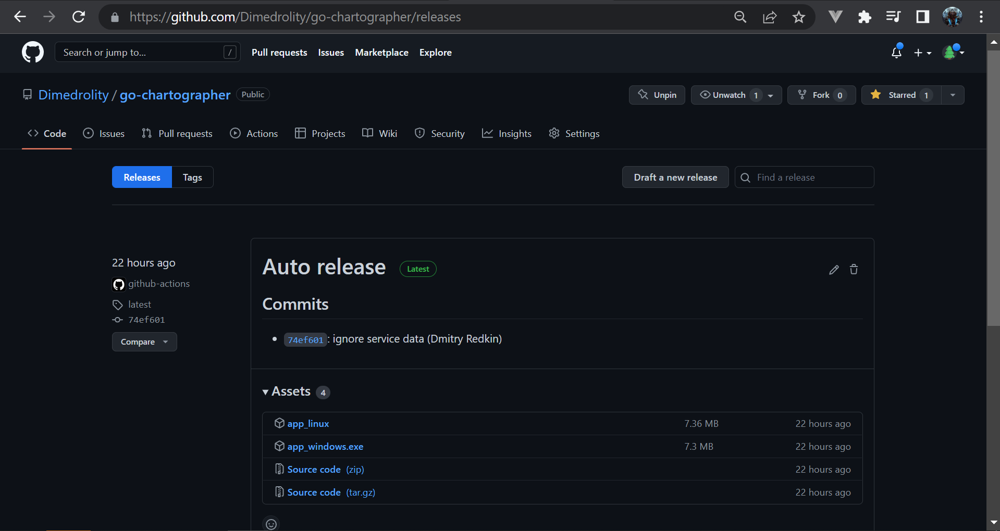
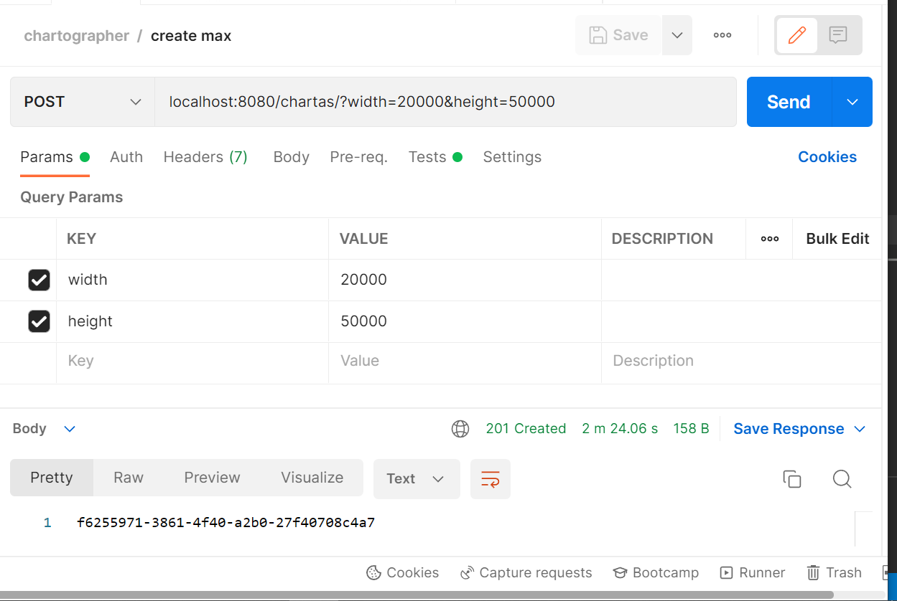
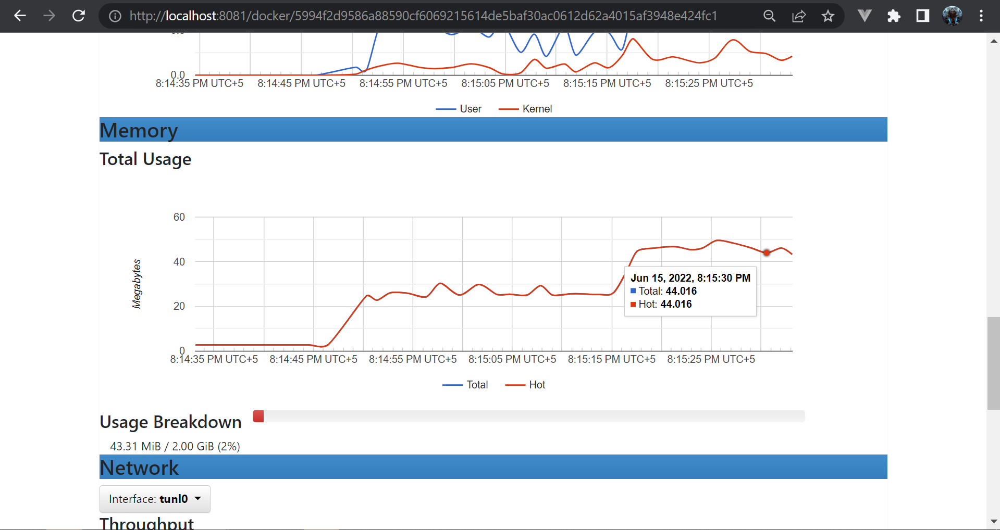
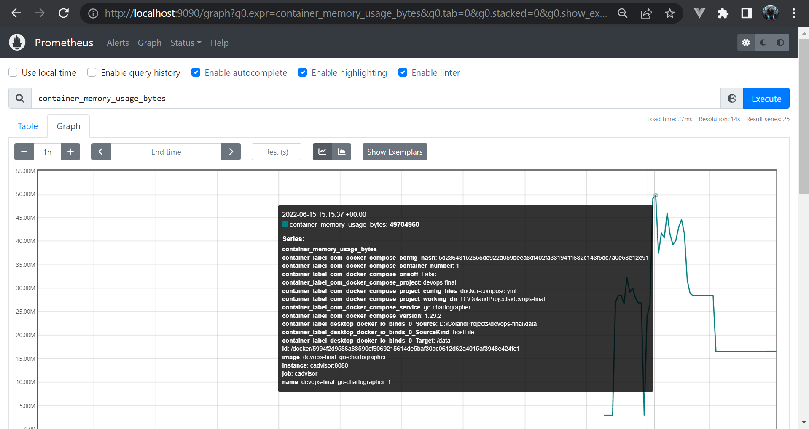

# Итоговое задание по дисциплине Программная инженерия

Этот файл является отчетом, в нем описаны цели проекта, используемые подходы и технологии.

## Go-приложение go-chartographer💎

Проект является тестовым заданием на стажировку. Целью создания были практика нового языка и устройство на стажировку. Задачи были следующие:
- написать сервис по работе с изображениями формата BMP, предоставляющий HTTP API
- покрыть проект модульными тестами

[Постановка задачи сервиса (документация API)](https://github.com/Dimedrolity/go-chartographer/blob/master/README_task.md)

[Описание решения](https://github.com/Dimedrolity/go-chartographer/blob/master/README.md) 

Подключен в текущий репозиторий как *git submodule*, так как является самостоятельным проектом, не зависит от текущего репозитория с инфраструктурой.

Дополнительно:

### Зависимости
Используется подход *вендоринг* - зависимости хранятся в репозитории (в папке vendor).

### .run
Используется для конфигурации запуска тестов и приложения с помощью IDE Goland. При наличии xml конфигов, IDE добавляет конфигурации автоматически


### Makefile
Используется для фиксации команд для запуска тестов, сборки и запуска.

### Docker🐳
Используется для контейнеризации Go-приложения.

#### multi-stage build
Собирается в контейнере *golang:1.17-alpine*, исполняемый файл перекладывается в контейнер *alpine*. Таким образом вес итогового образа **13 Mb**.

#### docker-compose
Используется для:
- конфигурации порта (чтобы не писать вручную при запуске через `docker run`)
- связанных директорий (*volumes* a.k.a. *bind mount*)
- установки переменных окружения в контейнере (по умолчанию используется файл .env)

Используется версия 2 файла docker-compose.yml, так как она позволяет указать ограничение по оперативной памяти контейнера (по условию тестового задания проверка сервиса будет в контейнере с 2 Гб памяти).
Версия 3 не позволяет указать ограничение, так как она создана для работы в связке с *docker swarm* - [ответ от авторов](https://github.com/docker/compose/issues/4513)

### Github Actions 🤖

Используется для реализации подхода Continious Integration. 

При пуше на Github на билд сервере происходит:

- запуск авто-тестов
- сборка под Windows и Linux
- создается Release на Github с *git тегом* latest
- в раздел assets релиза добавляются файлы сборки




## СAdvisor🦉
Используется для сбора метрик с Docker-контейнера Go-приложения.

## Prometheus🔥
Используется для получения метрик с cAdvisor.

## AlertManager⚠️
TODO алерты на память и диск

# Запуск
Должны быть установлены Git, Docker и docker-compose.

```
git clone --recurse-submodules git@github.com:Dimedrolity/devops-final.git

cd devops-final

docker-compose up --build
```

# Результат

С помощью docker-compose создаются docker образы и запускаются контейнеры. 

На **8080** порту будет **REST API Go-приложения**.


На **8081** порту **cAdvisor** Web UI с метриками контейнера Go-приложения.


На **9090** порту **Prometheus** Web UI с метриками контейнера Go-приложения
